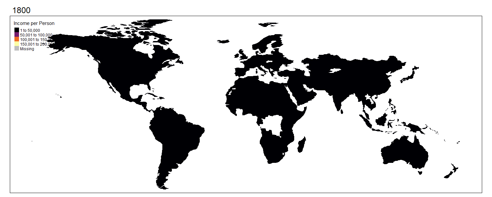
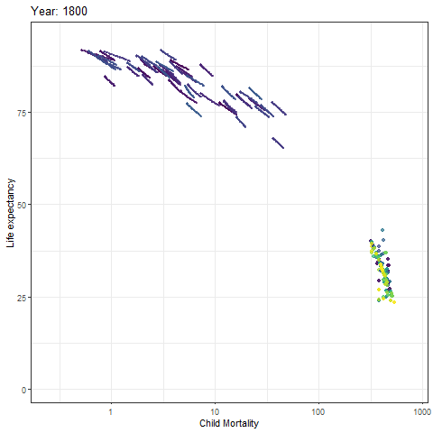
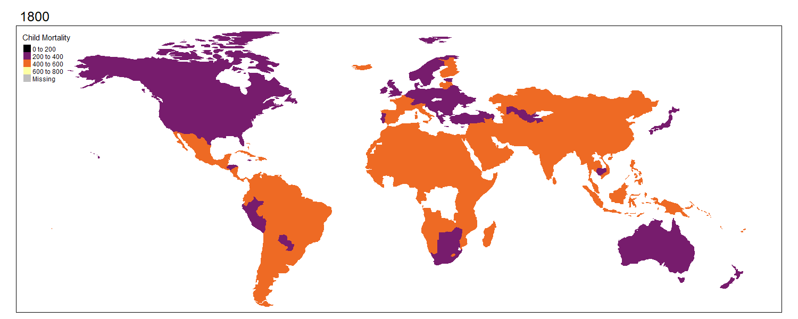
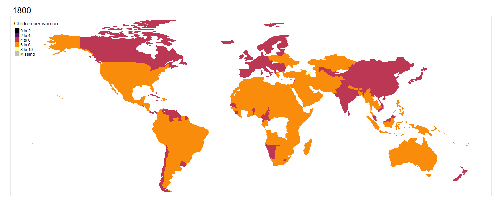
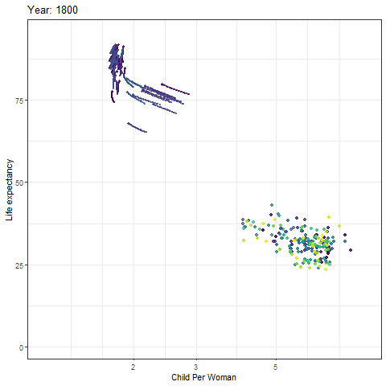
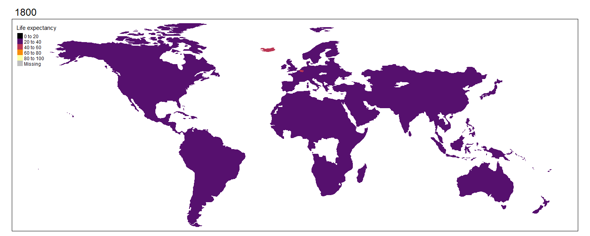
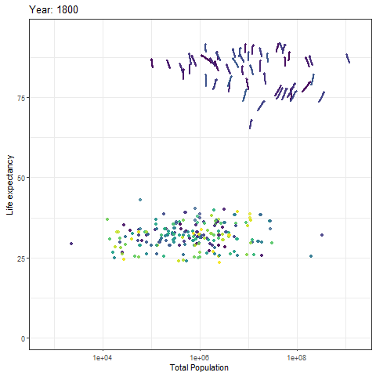
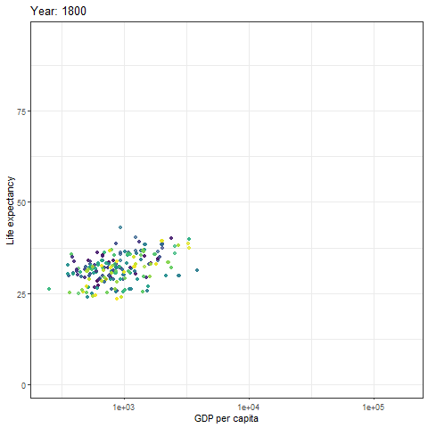

# ExploratoryDataAnalysis-R
In this mini project, I figured out an innovative ways to explore the data with animations in R
Here is the detailed report of the analysis

[report](https://docs.google.com/document/d/1h1mM7KjjHxVBH1CxH9syR_SD5g_n4IaYUz4k_Ctc2d4/edit?usp=sharing)
